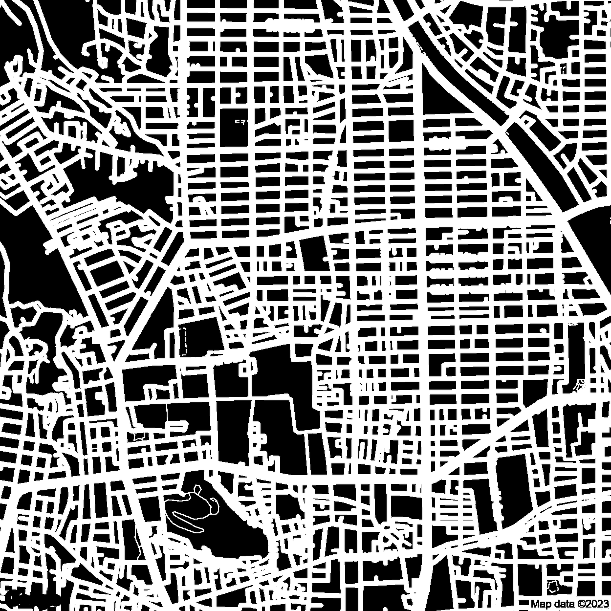

# Google-Road-Map
Code to get binary image map of roads from Google Maps Static API


# How to use
## 1. Clone this repository
```
$ git clone https://github.com/Naoki04/Google-Road-Map
```

## 2. Set API Key in "settings.yml"
settings.yml
```
Map:
  url: "https://maps.googleapis.com/maps/api/staticmap" # Endpoint
  key: "**API KEY**" # API Key
```

## 3. Set Coordinate of Map center, zoom and Run
main.py
```
coordinate = [35.0469245, 135.7464617] # Coordinate of Map Center (Shinomiya Arcade in Japan)
zoom = 15 # Area of Map (1:World, 5:Landmass/continent, 10:City, 15:Streets, 20:Buildings)
output_image_size = 5000 # resize to 5000x5000px
```
In default code, the output image size is 5000x5000px, equals to 1px=50cm
```
$ python main.py
```
